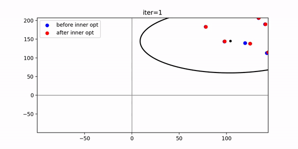

# non-convex optimisation: cma-es with gradients
#### Huajian Qiu
#### April 2020

## Introduction
A mathematical optimisation problem has the general form 

 
    
  
    

One relative simple case with nice property is called convex optimisation problem, in which the objective and constraint functions are convex, which means they satisfy the inequality

 

 
  
With . Notice, the linear programming is a special case of convex optimisation: equality replaces the more general inequality.

Nevertheless, in the state of art application of computer vision, researcher begin to investigate Geometric Deep Learning, i.e., learning a representation of 3D mesh in a latent code space(like 256 dimension). How to optimise this problem is a non-convex optimisation problem. 

In this project, I work on improving a global optimisation method-covariance matrix adaptation evolution strategy(CMA-ES) by exploiting **differentiablity**. In short, CMA-ES is very likely the most successful evolution stragety, with solid mathematics foundation. But it ignore the information of gradient, this is a pity in above optimisation problem. 

My stragety is to inject an inner optimiser into CMA-ES. Here is the demo of results when using this new optimiser on Ackley benchmark function.
Throughout all the semester, I tested several off-the-shelf optimiser and my proposed composite optimiser on BENCHMARK functions(like Ackley), rather than real computer vision problems.  

If you are interested, please refer to my report and presentation slides. By now, this semester project has been completed. But I will continue to extend the optimiser to be applied on a real 3D mesh reconstruction/shape optimisation problem in the summer as an intern or RA in the lab. This will be a real world computer vision challenge, called MeshSDF[4], a very recent work submitted at June 2020.

## Feedback
Open to hear some voice from you, you can write your ideas or any other comments by opening an issue. If you are interested to contribute to this project, welcome create your pull request.

## Reference

1. CMA-ES [https://en.wikipedia.org/wiki/CMA-ES]
2. Test Objective function [https://www.sfu.ca/~ssurjano/optimization.html]
3. Convex Optimization – Boyd and Vandenberghe [https://web.stanford.edu/~boyd/cvxbook/]
4. MeshSDF: Differentiable Iso-Surface Extraction [https://arxiv.org/abs/2006.03997]

